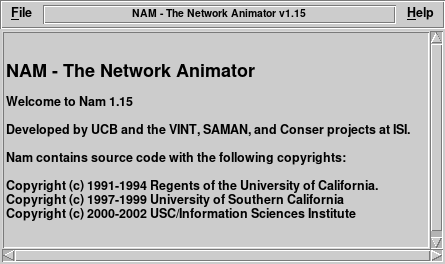
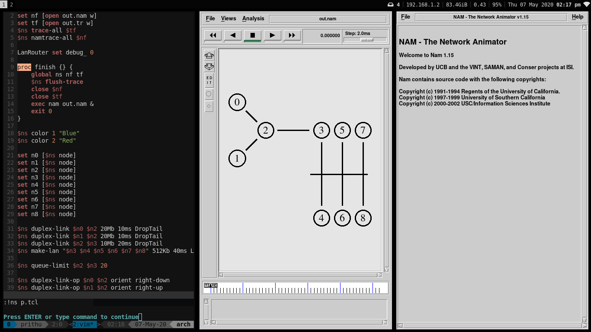
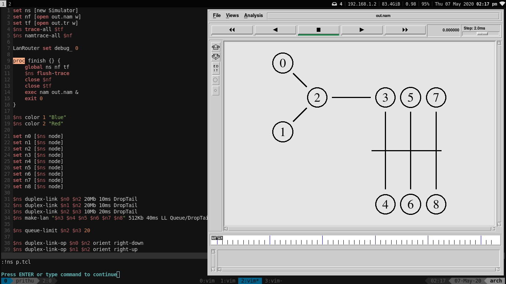

I see extendable software like vim and i3 really good tools to work with. I
think you should have control over how something works in your tool set. Tools
like vim and i3 allow for users to customize the workings in order fit their
needs - this is what makes them so powerful and a joy to use. There are many
instances where one feels the need to tweak their tools so that they could do
things which would make their lives a little more easier. Most of the times
these are small tweaks and this is where prgrams like vim and i3 shine.

One such instance of being able to tweak something was when I was working with
NS (network simulator) and preparing for my Computer Networks Lab exams. NS is
a network simulator and is built as a Tcl framework. It allows you to simlate
networking events like sending TCP traffic or pining a host, etc. A simulation
is run using the `ns <tcl-script>` command. This runs the simmulation and also
creates a `.nam` file that can be fed to NAM.  NAM is a Tcl/TK based animation
tool for viewing network simulation traces and real world packet traces.

Now for our labwork we were supposed to make the topography of the network and
run the simulation and to visualize it we were supposed to use NAM. This
becomes a cumbersome task - first, to run the tcl script using the `ns`
command; then, run `nam output.nam`. Now do this everytime you want to see the
changes take effect to the animation. All of this can simply be "automated"

first I add a small keybind to vim to run `ns` on the tcl script.

```
nnoremap <leader>n:!ns %<Enter>
```

I have set my leader key as `,` (comma). When I press `,+n` ns is called and
the argument passed to it is the current file's name that is being edited, that
is what "`%`" stands for. This then produces the nam file. The same tcl script
also has a "finish" procedure that is called at the end.

```
proc finish {} {
    global ns nf tf
    $ns flush-trace
    close $nf
    close $tf
    exec nam out.nam &
    exit 0
}
```

Here the line `exec nam out.nam &` calls the nam command.

So now I can just press `,+n` and the animation window comes up.  Now there's
another problem. The Nam window spawns another annoying small window that
serves no purpose but to display the version and some copyright info, and if
you close it, the main animation window gets closed as well.



Both theses windows open as normal windows in i3 and hence get tiled which is
again annoying as it messes up my terminal.



Instead of having the main window
tiled I would like it to be floating and to the right side of the screen. As
for the unwanted window, I would like it to be moved out of sight. This is
where I can configure i3 to manage the windows. I can configure i3 such
that the unwanted window is moved to a scratchpad workspace which is
basiclaly just a hidden workspace. And the main window can be moved to the
side of the screen and floating instead of tiling.

```
for_window [title="Nam Console v1.15"] floating enable move scratchpad
for_window [title="nam: (?i)"] floating enable resize set 800 720, move position 560 25
```

Custom rules can be applied to a window depending on their title and other
attributes as well. To find the title you can use the `xwininfo` tool. So for
any window that has a title "Nam Console v1.15" (which is the unwanted window),
i3 will move it the scratchpad workspace, out of sight. And for the main
animation window titled "nam <filename.nam>", i3 will set the window to float,
reisze it to 800x720 and move to position x=560 and y=25 on the screen.



